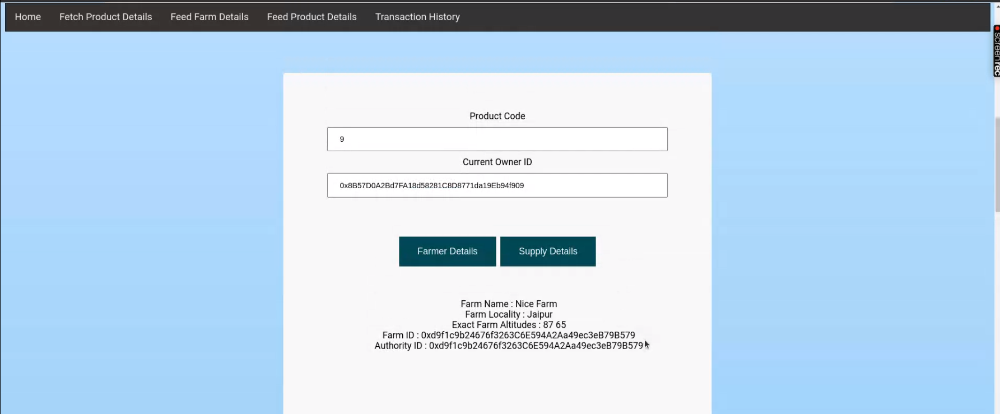
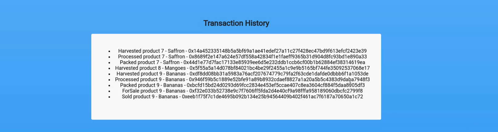

# Decentralized Agriculture Supply Chain Systems

This decentralized application regulates the agriculture supply chain by allowing the stakeholders to update and read the farm product status on Ethereum Blockchain.

The application is designed to enable easy and error-proof tracking of farm products from the farmer to the consumer.

## Features

- Users can fetch details of existing Products and Farms and also feed details of new Products and Farms.


- At the different stages of the supply chain, the concerned stakeholders can update and trace status of the shipment. 



- Entire transaction history is logged and the transactions can be validated on Etherscan using the Transaction ID.




## Set Up

- Pre requisites: Metamask, Ganache, Truffle Environment.
- Clone the repository and run ```npm i``` to install the required dependencies.
- Run ```truffle compile``` and then ```truffle migrate``` to instantiate the Smart Contracts.
- Run ```npm run start``` to start the application.

## Tech Stack

This Supply Chain project combines various different technologies:

- Node and Express - Node and Express are used to  setup the app.
- React - Client application is written with React
- Solidity - Smart Contracts are written in Solidity
- Ethereum - Dapp is developed using the Ethereum platform
- Truffle - Truffle is a development environment, testing framework and asset pipeline for blockchains using the Ethereum Virtual Machine. 
